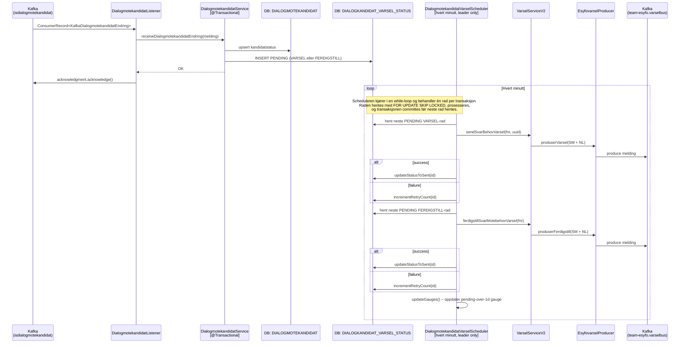
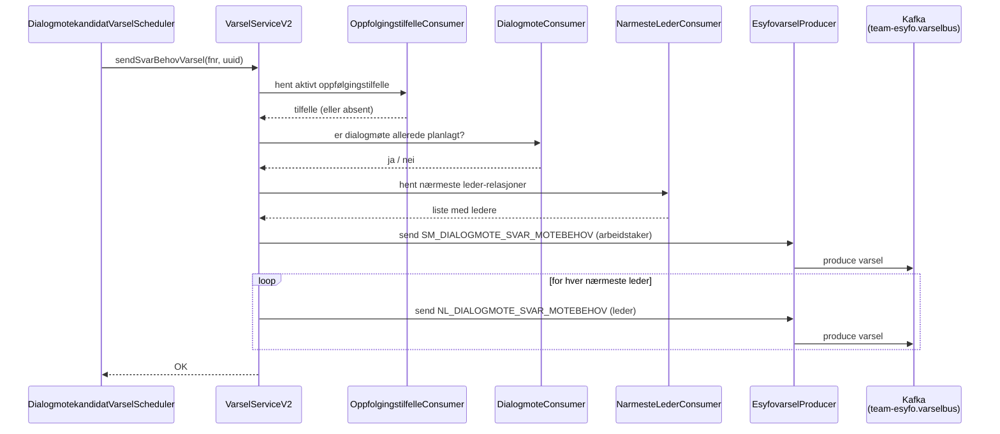
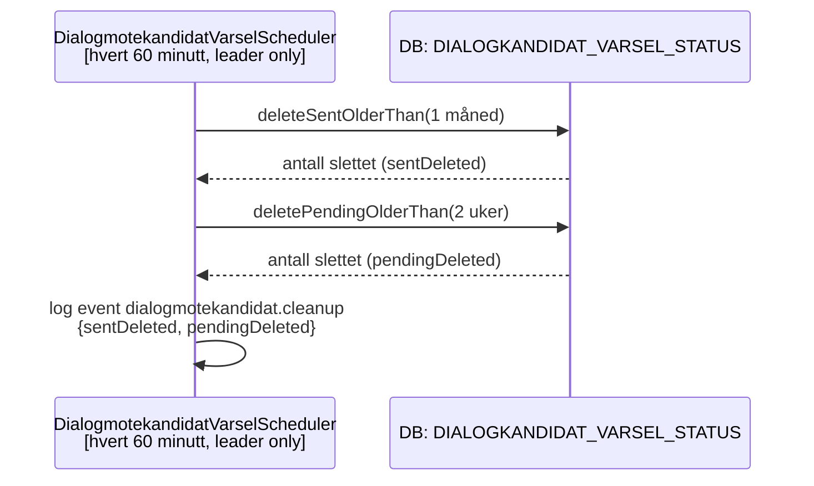

# Dialogmøtekandidat – varsel-flyt

Denne siden dokumenterer den komplette flyten fra en kandidat-melding ankommer på Kafka til varsel er sendt via **esyfovarsel**, inkludert feilhåndtering, metrikker og logging.

---

## Bakgrunn - outbox-mønsteret

Før outbox-mønsteret ble innført ble varsel sendt direkte fra `DialogmotekandidatService` i én og samme transaksjon som kandidatoppdateringen. Det medførte to problemer:

1. **Partial failure**: Hvis kallet til esyfovarsel feilet etter at databaseraden var persistert, gikk varselet tapt uten mulighet for retry.
2. **Kafka-retries blokkert**: Fordi feil i API-kallet kastet unntak oppover, ble ikke Kafka-offsetten bekreftet, noe som låste lytteren og trigget uendelige retries på *samme* melding.

Med outbox-mønsteret splittes ansvaret i to separate steg:

| Steg | Komponent | Ansvar |
|---|---|---|
| **Motta og lagre** | `DialogmotekandidatListener` + `DialogmotekandidatService` | Lytter på Kafka-topic `teamsykefravr.isdialogmotekandidat-dialogmotekandidat`. Persisterer kandidatstatus og setter inn en `PENDING`-rad i `DIALOGKANDIDAT_VARSEL_STATUS`. Bekrefter Kafka-offset. |
| **Sende varsel** | `DialogmotekandidatVarselScheduler` | Poller `PENDING`-rader hvert minutt og kaller esyfovarsel. Har innebygd retry med eksponentiell backoff. |
| **Rydde opp** | `DialogmotekandidatVarselScheduler.runCleanUp()` | Sletter gamle `SENT`- og `PENDING`-rader én gang i timen. |

---

## Full flyt – sekvensdiagram



---

## Retry, låsing og prosessering

### Eksponentiell backoff

Ved feil øker `incrementRetryCount` både `retry_count` og `next_retry_at`.

- Neste forsøk beregnes som `2^retry_count` minutter
- Backoff er begrenset til maks `720` minutter, altså 12 timer
- Scheduleren henter bare rader der `next_retry_at <= NOW()`
- Rader med `next_retry_at > NOW()` hoppes over til de er klare for nytt forsøk

Det betyr at retry styres av databasen, ikke av en sleep i scheduleren.

### FOR UPDATE SKIP LOCKED

`getPendingByType` bruker `SELECT ... FOR UPDATE SKIP LOCKED`.

Det sikrer at to parallelle instanser ikke prosesserer samme rad hvis det oppstår overlapp, for eksempel under leader-failover. En rad som allerede er låst i én transaksjon blir hoppet over av neste transaksjon.

### Én rad per transaksjon

`DialogmotekandidatVarselScheduler` bruker `TransactionTemplate` med `PROPAGATION_REQUIRES_NEW` og kjører i en `while`-loop.

For hver iterasjon skjer dette:

1. Hent én rad med `getPendingByType(..., limit = 1)`
2. Lås raden med `FOR UPDATE SKIP LOCKED`
3. Send varsel eller ferdigstill varsel
4. Oppdater status eller retry-teller
5. Commit transaksjonen før neste rad hentes

Dette gjør at row-locken holdes under hele varsel-sendingen for den raden som behandles.

### Row count check ved oppdatering til `SENT`

`updateStatusToSent` returnerer `Boolean`.

- `true` når en rad faktisk ble oppdatert
- `false` når 0 rader ble oppdatert

Hvis 0 rader blir oppdatert, logges warning med event `dialogmotekandidat.varsel_status.update_missing`. Det gjør race conditions og tilfeller der raden allerede er slettet synlige i loggene.

---

## Beslutningslogikk i DialogmotekandidatService – flowchart

Logikken i `receiveDialogmotekandidatEndring` avgjør hvilken `PENDING`-rad som settes inn (eller om meldingen ignoreres).


### Beslutningstabell

| Melding: `kandidat` | DB: eksisterende rad | Resultat |
|---|---|---|
| *(DB er nyere)* | — | **IGNORE** (`newer_change_exists`) |
| `true` | ingen rad | **VARSEL** |
| `true` | `kandidat=true` | **IGNORE** (`already_kandidat`) |
| `true` | `kandidat=false` | **VARSEL** |
| `false` | ingen rad | **FERDIGSTILL** |
| `false` | `kandidat=false` | **FERDIGSTILL** |
| `false` | `kandidat=true` | **FERDIGSTILL** |

---

## Esyfovarsel-utsendelse – sekvensdiagram



**`ferdigstillSvarMotebehovVarsel(fnr)`** følger tilsvarende mønster, men hopper over tilfelle/møtesjekk og lukker varsel for arbeidstaker og alle nærmeste ledere.

---

## Opprydding – sekvensdiagram



`PENDING`-rader eldre enn 2 uker regnes som ikke-leverbare og fjernes for å unngå evig retry.

---

## Strukturert logging

Alle log-hendelser bruker `net.logstash.logback.argument.StructuredArguments.kv` og produserer JSON-logger som kan søkes i Grafana Loki.

| Event | Komponent | Beskrivelse | Felter |
|---|---|---|---|
| `dialogmotekandidat.received` | `DialogmotekandidatListener` | Ny Kafka-melding mottatt | `event`, `topic`, `uuid` |
| `dialogmotekandidat.ignored` | `DialogmotekandidatService` | Melding ignorert | `event`, `reason` (`newer_change_exists` / `already_kandidat`), `messageId` |
| `dialogmotekandidat.created` | `DialogmotekandidatService` | Ny kandidatrad opprettet | `event`, `messageId` |
| `dialogmotekandidat.updated` | `DialogmotekandidatService` | Eksisterende kandidat oppdatert | `event`, `messageId` |
| `dialogmotekandidat.varsel.sent` | `DialogmotekandidatVarselScheduler` | Varsel sendt OK | `event`, `id`, `messageId` |
| `dialogmotekandidat.varsel.retry` | `DialogmotekandidatVarselScheduler` | Varsel feilet, teller økt | `event`, `id`, `messageId`, `retryCount` |
| `dialogmotekandidat.ferdigstill.sent` | `DialogmotekandidatVarselScheduler` | Ferdigstilling sendt OK | `event`, `id`, `messageId` |
| `dialogmotekandidat.ferdigstill.retry` | `DialogmotekandidatVarselScheduler` | Ferdigstilling feilet, teller økt | `event`, `id`, `messageId`, `retryCount` |
| `dialogmotekandidat.varsel_status.update_missing` | `DialogmotekandidatVarselStatusDao` | Ingen rad ble markert som `SENT` | `event`, `id` |
| `dialogmotekandidat.cleanup` | `DialogmotekandidatVarselScheduler` | Opprydding gjennomført | `event`, `sentDeleted`, `pendingDeleted` |

### Loki-eksempel – spore én melding gjennom retry-løkken

```logql
{app="syfomotebehov"} | json | event="dialogmotekandidat.varsel.retry" | messageId="<uuid>"
```

Bytt ut `<uuid>` med `uuid`-verdien fra den opprinnelige `dialogmotekandidat.received`-hendelsen.

---

## Prometheus-metrikker

Scheduleren eksponerer to gauges som måler «stuck» rader – `PENDING`-rader som har ligget usendt i mer enn én dag.

| Metrikknavn | Tag | Beskrivelse |
|---|---|---|
| `dialogkandidat_varsel_pending_over_1d_total` | `type=VARSEL` | Antall VARSEL-rader som har vært `PENDING` i mer enn 1 dag |
| `dialogkandidat_varsel_pending_over_1d_total` | `type=FERDIGSTILL` | Antall FERDIGSTILL-rader som har vært `PENDING` i mer enn 1 dag |

### PromQL-eksempel

```promql
dialogkandidat_varsel_pending_over_1d_total{app="syfomotebehov", type="VARSEL"} > 0
```

### Anbefalt alert

Trigger hvis verdien er `> 0` i mer enn **30 minutter**. Det indikerer at scheduleren ikke klarer å levere varslene, og krever manuell undersøkelse (sjekk esyfovarsel-connectivitet og retry-tellere i Loki).

---

## Tabellskjema – `DIALOGKANDIDAT_VARSEL_STATUS`

| Kolonne | Type | Beskrivelse |
|---|---|---|
| `id` | `UUID` | Primærnøkkel |
| `kafka_melding_uuid` | `VARCHAR(36)` | Unik referanse til Kafka-meldingen |
| `fnr` | `VARCHAR(11)` | Fødselsnummer for personen som varselet gjelder |
| `type` | `VARCHAR(20)` | `VARSEL` eller `FERDIGSTILL` |
| `status` | `VARCHAR(20)` | `PENDING` eller `SENT` |
| `retry_count` | `INT NOT NULL DEFAULT 0` | Antall retry-forsøk så langt |
| `next_retry_at` | `TIMESTAMP NOT NULL DEFAULT NOW()` | Tidspunktet som styrer når raden tidligst kan prøves igjen |
| `created_at` | `TIMESTAMP NOT NULL DEFAULT NOW()` | Når raden ble opprettet |
| `updated_at` | `TIMESTAMP NOT NULL DEFAULT NOW()` | Når raden sist ble oppdatert |

Tabellen opprettes i migreringen `V1_22__dialogmotekandidat_varsel_status.sql`.
