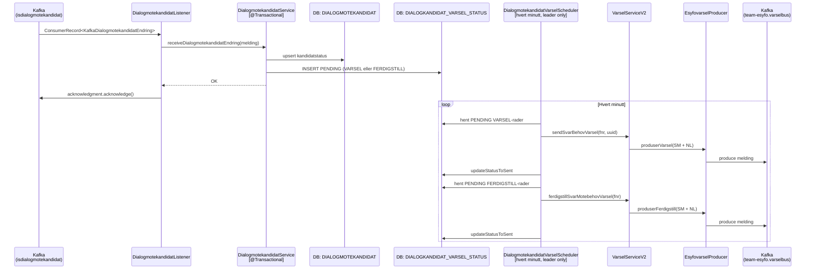
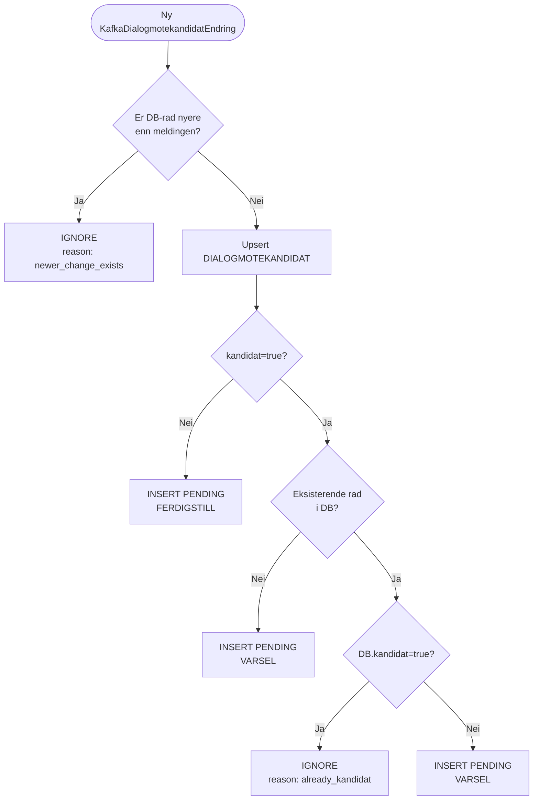
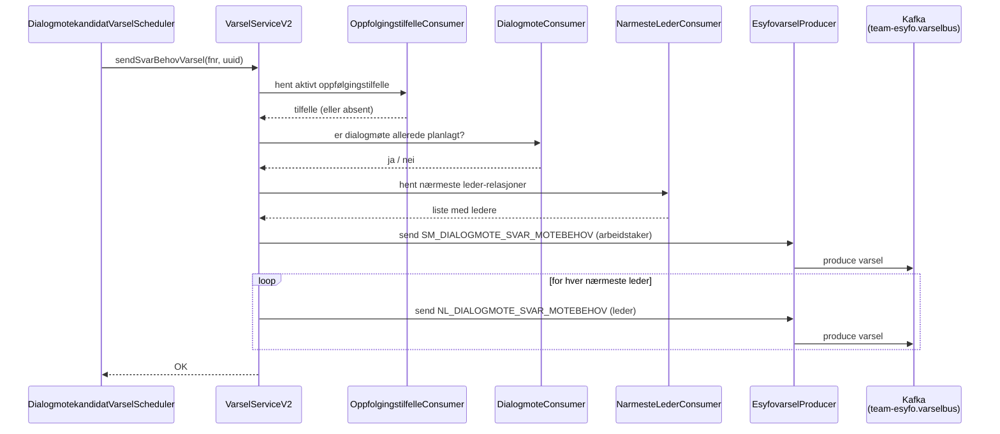
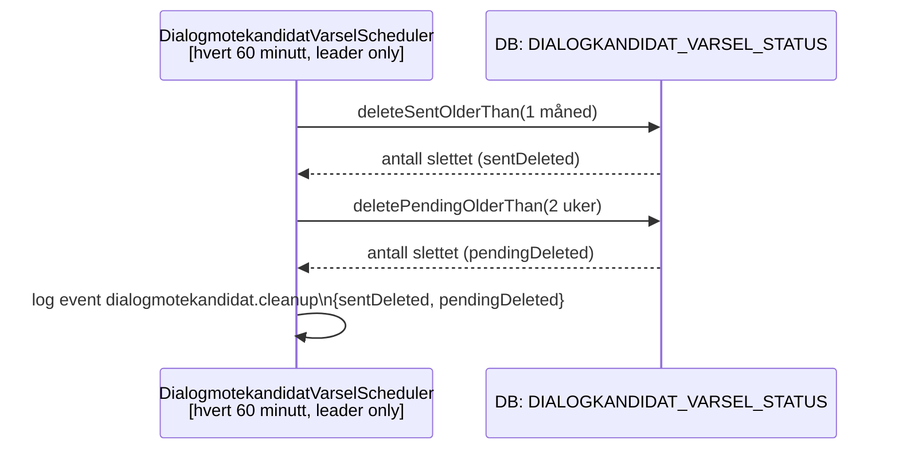

# Dialogmøtekandidat – varsel-flyt

Denne siden dokumenterer den komplette flyten fra en kandidat-melding ankommer på Kafka til varsel er sendt via **esyfovarsel**, inkludert feilhåndtering, metrikker og logging.

---

## 1. Innledning

### Bakgrunn – outbox-mønsteret

Før outbox-mønsteret ble innført ble varsel sendt direkte fra `DialogmotekandidatService` i én og samme transaksjon som kandidatoppdateringen. Det medførte to problemer:

1. **Partial failure**: Hvis kallet til esyfovarsel feilet etter at databaseraden var persistert, gikk varselet tapt uten mulighet for retry.
2. **Kafka-retries blokkert**: Fordi feil i API-kallet kastet unntak oppover, ble ikke Kafka-offsetten bekreftet, noe som låste lytteren og trigget uendelige retries på *samme* melding.

Med outbox-mønsteret splittes ansvaret i to separate steg:

| Steg | Komponent | Ansvar |
|---|---|---|
| **Motta og lagre** | `DialogmotekandidatListener` + `DialogmotekandidatService` | Persisterer kandidatstatus og setter inn en `PENDING`-rad i `DIALOGKANDIDAT_VARSEL_STATUS`. Bekrefter Kafka-offset. |
| **Sende varsel** | `DialogmotekandidatVarselScheduler` | Poller `PENDING`-rader hvert minutt og kaller esyfovarsel. Har innebygd retry-teller. |
| **Rydde opp** | `DialogmotekandidatVarselScheduler.runCleanUp()` | Sletter gamle `SENT`- og `PENDING`-rader én gang i timen. |

---

## 2. Full flyt – sekvensdiagram



---

## 3. Beslutningslogikk – flowchart

Logikken i `receiveDialogmotekandidatEndring` avgjør hvilken `PENDING`-rad som settes inn (eller om meldingen ignoreres).



### Beslutningstabell

| Melding: `kandidat` | DB: eksisterende rad | Resultat |
|---|---|---|
| *(DB er nyere)* | — | **IGNORE** (`newer_change_exists`) |
| `true` | ingen rad | **VARSEL** |
| `true` | `kandidat=true` | **IGNORE** (`already_kandidat`) |
| `true` | `kandidat=false` | **VARSEL** |
| `false` | ingen rad | **FERDIGSTILL** |
| `false` | `kandidat=false` | **FERDIGSTILL** |
| `false` | `kandidat=true` | **FERDIGSTILL** |

---

## 4. Esyfovarsel-utsendelse – sekvensdiagram



**`ferdigstillSvarMotebehovVarsel(fnr)`** følger tilsvarende mønster, men hopper over tilfelle/møtesjekk og lukker varsel for arbeidstaker og alle nærmeste ledere.

---

## 5. Opprydding – sekvensdiagram



`PENDING`-rader eldre enn 2 uker regnes som ikke-leverbare og fjernes for å unngå evig retry.

---

## 6. Strukturert logging

Alle log-hendelser bruker `net.logstash.logback.argument.StructuredArguments.kv` og produserer JSON-logger som kan søkes i Grafana Loki.

| Event | Komponent | Beskrivelse | Felter |
|---|---|---|---|
| `dialogmotekandidat.received` | `DialogmotekandidatListener` | Ny Kafka-melding mottatt | `event`, `topic`, `uuid` |
| `dialogmotekandidat.ignored` | `DialogmotekandidatService` | Melding ignorert | `event`, `reason` (`newer_change_exists` / `already_kandidat`), `messageId` |
| `dialogmotekandidat.created` | `DialogmotekandidatService` | Ny kandidatrad opprettet | `event`, `messageId` |
| `dialogmotekandidat.updated` | `DialogmotekandidatService` | Eksisterende kandidat oppdatert | `event`, `messageId` |
| `dialogmotekandidat.varsel.sent` | `DialogmotekandidatVarselScheduler` | Varsel sendt OK | `event`, `id`, `messageId` |
| `dialogmotekandidat.varsel.retry` | `DialogmotekandidatVarselScheduler` | Varsel feilet, teller økt | `event`, `id`, `messageId`, `retryCount` |
| `dialogmotekandidat.ferdigstill.sent` | `DialogmotekandidatVarselScheduler` | Ferdigstilling sendt OK | `event`, `id`, `messageId` |
| `dialogmotekandidat.ferdigstill.retry` | `DialogmotekandidatVarselScheduler` | Ferdigstilling feilet, teller økt | `event`, `id`, `messageId`, `retryCount` |
| `dialogmotekandidat.cleanup` | `DialogmotekandidatVarselScheduler` | Opprydding gjennomført | `event`, `sentDeleted`, `pendingDeleted` |

### Loki-eksempel – spore én melding gjennom retry-løkken

```logql
{app="syfomotebehov"} | json | event="dialogmotekandidat.varsel.retry" | messageId="<uuid>"
```

Bytt ut `<uuid>` med `uuid`-verdien fra den opprinnelige `dialogmotekandidat.received`-hendelsen.

---

## 7. Prometheus-metrikker

Scheduleren eksponerer to gauges som måler «stuck» rader – `PENDING`-rader som har ligget usendt i mer enn én dag.

| Metrikknavn | Tag | Beskrivelse |
|---|---|---|
| `dialogkandidat_varsel_pending_over_1d_total` | `type=VARSEL` | Antall VARSEL-rader som har vært `PENDING` i mer enn 1 dag |
| `dialogkandidat_varsel_pending_over_1d_total` | `type=FERDIGSTILL` | Antall FERDIGSTILL-rader som har vært `PENDING` i mer enn 1 dag |

### PromQL-eksempel

```promql
dialogkandidat_varsel_pending_over_1d_total{app="syfomotebehov", type="VARSEL"} > 0
```

### Anbefalt alert

Trigger hvis verdien er `> 0` i mer enn **30 minutter**. Det indikerer at scheduleren ikke klarer å levere varslene, og krever manuell undersøkelse (sjekk esyfovarsel-connectivitet og retry-tellere i Loki).
